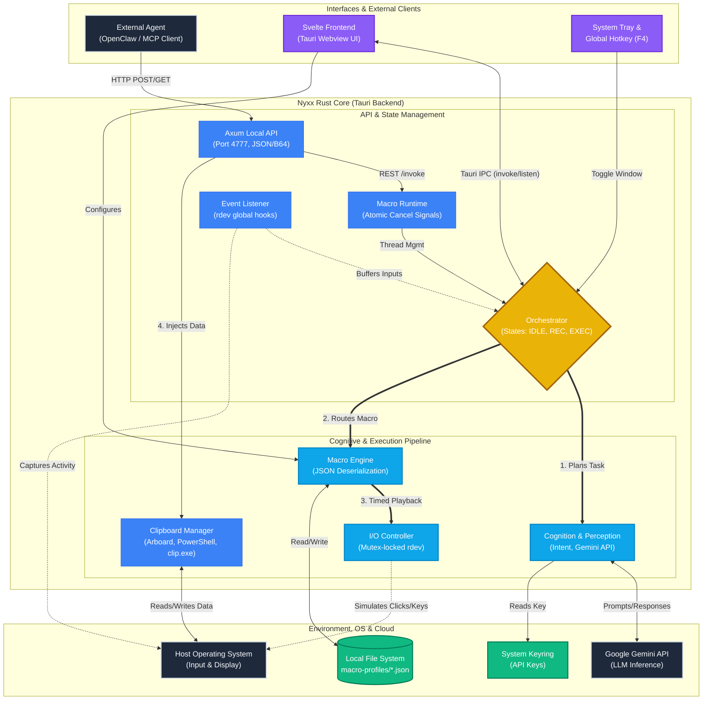

# Nyxx

Desktop automation bridge for local AI agents. Nyxx runs as a **Tauri** app (Rust backend, Svelte UI) and exposes a **localhost-only HTTP API** so tools such as [OpenClaw](https://github.com/openclaw/openclaw) can list, record, and run macro workflows: keyboard, mouse, and clipboard hand-off for apps that have no API.

## What it is for

Many desktop and legacy applications only expose a graphical UI. Nyxx records or drives those interactions, uses the **system clipboard** (and optional image payloads) to move data between the agent and the app, and returns captured output to the caller. Execution is constrained to **predefined macros** instead of arbitrary shell access from the model.

## How it fits together

1. An agent (for example OpenClaw) receives a user goal and calls the **nyxx-macro-control** skill, which talks to Nyxx over `http://127.0.0.1:4777`.
2. Nyxx brings the right window forward, runs the saved macro (clicks, keys, navigation).
3. Text or image data is read back via clipboard or API response fields (`output_text`, `output_image_base64` on POST invocations).
4. The agent summarizes or forwards the result to the user.

## Design


## Repository layout

| Path | Role |
| --- | --- |
| `src/` | Svelte + Vite frontend (macro UI, dev server on port 5173 in dev). |
| `src-tauri/` | Rust crate: orchestrator, Axum API, input simulation, Tauri shell. |
| `.openclaw/` | OpenClaw-oriented skill definition (`SKILL.md`, name `nyxx-macro-control`). |
| `nyxx-web/` | Optional Next.js showcase site (separate from the desktop app). |
| `docs/` | Architecture, roadmap, and product notes. |

## Prerequisites

- **Rust** (stable; see `src-tauri/Cargo.toml` for `rust-version`).
- **Node.js** 18+ and **npm** (the Tauri config runs `npm run dev` / `npm run build` in `src/`). If you use **pnpm**, install dependencies with `pnpm install` in `src/` and adjust or mirror the `beforeDevCommand` / `beforeBuildCommand` in `src-tauri/tauri.conf.json` if needed.
- **OpenClaw** (or another MCP-capable client) if you want chat-driven control; the app still runs standalone for local API and GUI use.

## Build and run (desktop app)

```bash
git clone https://github.com/zendrix396/nyxx.git
cd nyxx
cd src
npm install
cd ../src-tauri
cargo tauri dev
```

For a release build:

```bash
cd src && npm run build && cd ../src-tauri && cargo tauri build
```

The local API listens on **`127.0.0.1:4777`** by default (see `api_server.rs` if you change the port).

## HTTP API (summary)

Agents should treat **`GET /help`** as the source of truth for macro metadata (HTTP method, input/output kinds). Common routes:

| Method | Path | Purpose |
| --- | --- | --- |
| GET | `/help` | Macro metadata and invocation rules. |
| GET | `/macros` | List macros. |
| GET | `/macros/:name/invoke` | Run a **GET**-configured macro (no output body fields). |
| POST | `/macros/:name/invoke` | Run a macro; JSON body may include `text`, `image_base64`, etc. |
| POST | `/macros/stop`, `/macros/stop-all` | Stop running macro(s). |
| POST | `/recording/start`, `/recording/stop` | Recording lifecycle. |
| POST | `/mouse/move`, `POST /mouse/drag` | Cursor control. |
| DELETE | `/macros/:name` | Remove a macro profile. |

Exact field names and behavior are documented in `.openclaw/SKILL.md` and implemented in `src-tauri/src/api_server.rs`.

## Connecting OpenClaw

Install the skill from this repo: use **`.openclaw/SKILL.md`** (frontmatter name: `nyxx-macro-control`) and place it where your OpenClaw install expects skills (for example under an `agents` / `skills` tree). Start Nyxx first so `http://127.0.0.1:4777` is reachable.

## Optional: showcase site

The `nyxx-web/` directory is a small Next.js demo. See `nyxx-web/README.md` for `npm install` / `npm run dev` (default port 3000).

## Security notes

- Traffic is intended to stay on **loopback**; keep the server bound to `127.0.0.1` in untrusted networks.
- Macros are explicit, user-defined automation paths. Review recordings before exposing them to an agent.
- Nyxx does not need to send your screen to a cloud service for the core macro API; still treat clipboard contents and macro outputs as sensitive.

## More documentation

See **`docs/`** for architecture deep-dives, flow, and roadmap.
