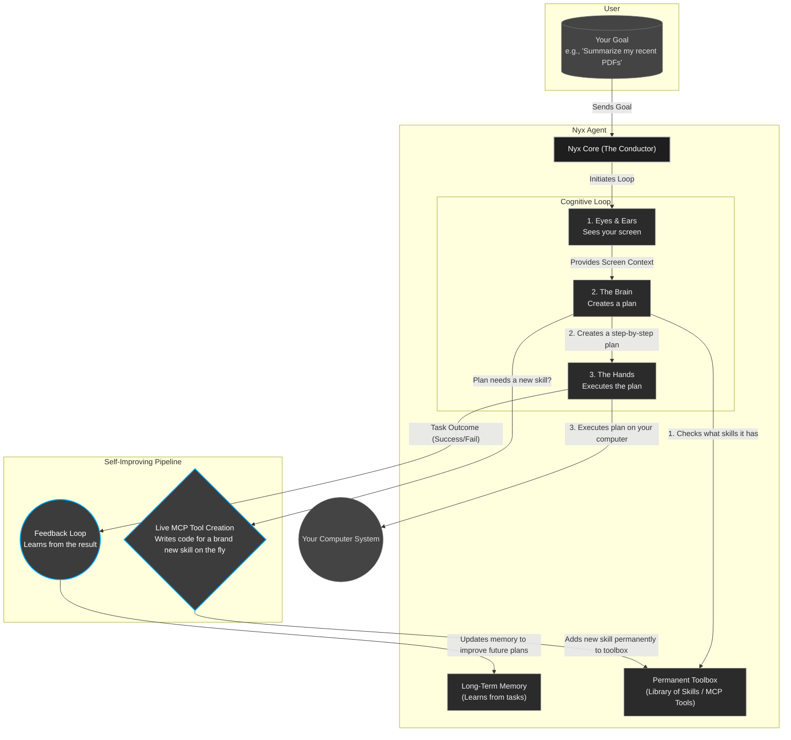
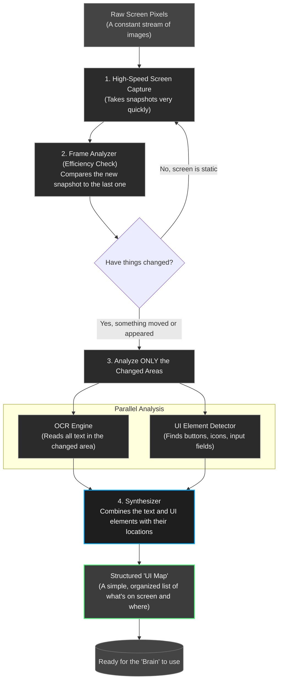
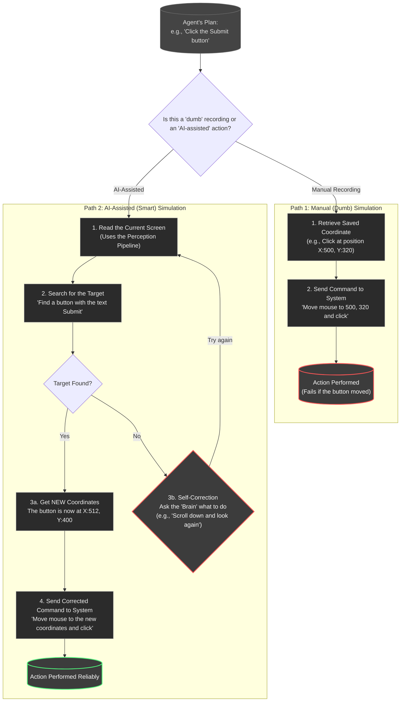
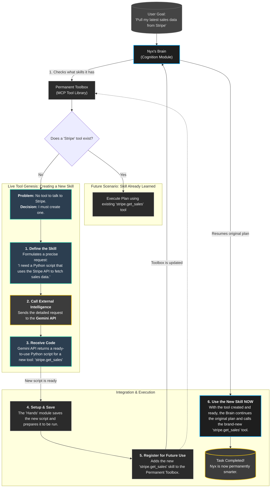

```mermaid
graph TD
    %% --- Style Definitions for Dark Theme ---
    classDef dark fill:#2b2b2b,stroke:#999,color:#f0f0f0;
    classDef core fill:#1e1e1e,stroke:#ccc,color:#ffffff,stroke-width:2px;
    classDef io fill:#444,stroke:#777,color:#e0e0e0;
    classDef special fill:#3c3c3c,stroke:#00aaff,color:#ffffff,stroke-width:2px;

    %% --- Main Components ---
    subgraph User
        UserInput[("Your Goal<br/>e.g., 'Summarize my recent PDFs'")]:::io
    end

    subgraph Nyx Agent
        Orchestrator["Nyx Core (The Conductor)"]:::core
        
        subgraph Cognitive Loop
            direction TB
            Perception["1. Eyes & Ears<br/>Sees your screen"]:::dark
            Cognition["2. The Brain<br/>Creates a plan"]:::dark
            Action["3. The Hands<br/>Executes the plan"]:::dark
        end

        Knowledge["Long-Term Memory<br/>(Learns from tasks)"]:::dark
        Toolbox["Permanent Toolbox<br/>(Library of Skills / MCP Tools)"]:::dark
    end
    
    %% --- Execution Flow ---
    UserInput -- "Sends Goal" --> Orchestrator
    Orchestrator -- "Initiates Loop" --> Perception
    Perception -- "Provides Screen Context" --> Cognition
    Cognition -- "1. Checks what skills it has" --> Toolbox
    Cognition -- "2. Creates a step-by-step plan" --> Action
    Action -- "3. Executes plan on your computer" --> System(("Your Computer System")):::io
    
    %% --- Self-Improving & Live Tool Creation Flow ---
    subgraph "Self-Improving Pipeline"
        direction TB
        Cognition -- "Plan needs a new skill?" --> ToolGenesis{"Live MCP Tool Creation<br/>Writes code for a brand new skill on the fly"}:::special
        ToolGenesis -- "Adds new skill permanently to toolbox" --> Toolbox
        
        Action -- "Task Outcome (Success/Fail)" --> FeedbackLoop((Feedback Loop<br/>Learns from the result)):::special
        FeedbackLoop -- "Updates memory to improve future plans" --> Knowledge
    end
```

```mermaid
graph TD
    %% --- Style Definitions for Dark Theme ---
    classDef dark fill:#2b2b2b,stroke:#999,color:#f0f0f0;
    classDef core fill:#1e1e1e,stroke:#00aaff,color:#ffffff,stroke-width:2px;
    classDef io fill:#444,stroke:#777,color:#e0e0e0;
    classDef highlight fill:#3c3c3c,stroke:#50fa7b,color:#ffffff,stroke-width:2px;

    %% --- The Pipeline ---
    A["Raw Screen Pixels<br/>(A constant stream of images)"]:::io
    B["1. High-Speed Screen Capture<br/>(Takes snapshots very quickly)"]:::dark
    C["2. Frame Analyzer (Efficiency Check)<br/>Compares the new snapshot to the last one"]:::dark
    
    A --> B --> C

    C --> D{Have things changed?}
    D -- "No, screen is static" --> B
    D -- "Yes, something moved or appeared" --> E["3. Analyze ONLY the Changed Areas"]:::dark
    
    subgraph "Parallel Analysis"
        direction LR
        F["OCR Engine<br/>(Reads all text in the changed area)"]:::dark
        G["UI Element Detector<br/>(Finds buttons, icons, input fields)"]:::dark
    end

    E --> F
    E --> G

    F --> H["4. Synthesizer<br/>Combines the text and UI elements with their locations"]:::core
    G --> H
    
    H --> I["Structured 'UI Map'<br/>(A simple, organized list of what's on screen and where)"]:::highlight
    I --> J[("Ready for the 'Brain' to use")]:::io
```

```mermaid
graph TD
    %% --- Style Definitions for Dark Theme ---
    classDef dark fill:#2b2b2b,stroke:#999,color:#f0f0f0;
    classDef core fill:#1e1e1e,stroke:#00aaff,color:#ffffff,stroke-width:2px;
    classDef io fill:#444,stroke:#777,color:#e0e0e0;
    classDef highlight fill:#3c3c3c,stroke:#50fa7b,color:#ffffff,stroke-width:2px;
    classDef alert fill:#3c3c3c,stroke:#ff5555,color:#ffffff,stroke-width:2px;

    %% --- The Pipeline ---
    Start[("Agent's Plan:<br/>e.g., 'Click the Submit button'")]:::io
    
    Start --> A{Is this a 'dumb' recording or an 'AI-assisted' action?}
    
    subgraph "Path 1: Manual (Dumb) Simulation"
        direction TB
        B["1. Retrieve Saved Coordinate<br/>(e.g., Click at position X:500, Y:320)"]:::dark
        C["2. Send Command to System<br/>'Move mouse to 500, 320 and click'"]:::dark
        D[("Action Performed<br/>(Fails if the button moved)")]:::alert
    end
    
    subgraph "Path 2: AI-Assisted (Smart) Simulation"
        direction TB
        E["1. Read the Current Screen<br/>(Uses the Perception Pipeline)"]:::dark
        F["2. Search for the Target<br/>'Find a button with the text Submit'"]:::dark
        G{Target Found?}
        H["3a. Get NEW Coordinates<br/>The button is now at X:512, Y:400"]:::dark
        I{"3b. Self-Correction<br/>Ask the 'Brain' what to do<br/>(e.g., 'Scroll down and look again')"}:::alert
        J["4. Send Corrected Command to System<br/>'Move mouse to the new coordinates and click'"]:::dark
        K[("Action Performed Reliably")]:::highlight
    end

    A -- "Manual Recording" --> B --> C --> D
    A -- "AI-Assisted" --> E --> F --> G
    G -- "Yes" --> H --> J
    G -- "No" --> I -- "Try again" --> E
    J --> K
```

```mermaid
graph TD
    %% --- Style Definitions for Dark Theme ---
    classDef dark fill:#2b2b2b,stroke:#999,color:#f0f0f0;
    classDef core fill:#1e1e1e,stroke:#00aaff,color:#ffffff,stroke-width:2px;
    classDef io fill:#444,stroke:#777,color:#e0e0e0;
    classDef plan fill:#333,stroke:#aaa,color:#ddd,stroke-dasharray: 3 3;
    classDef data fill:#3c3c3c,stroke:#50fa7b,color:#ffffff;

    %% --- The Start of the Flow ---
    A[("User Goal:<br/>'Find, summarize, and move PDFs I downloaded this week'")]:::io
    B["Nyx's Brain (Cognition Module)<br/>Generates a step-by-step execution plan"]:::core
    C["Nyx's Hands (Tooling Module)<br/>Receives the plan and executes each step"]:::core

    A --> B --> C

    %% --- The Generated Plan and Execution Flow ---
    subgraph "Execution Pipeline"
        direction TB
        
        S1["<b>Step 1: Search Files</b><br/>Skill Call: `file.search`"]:::plan
        D1[("Data Out:<br/>[file1.pdf, file2.pdf, ...]")]:::data

        S2["<b>Step 2: Filter by Date</b><br/>Skill Call: `filter_by_date`"]:::plan
        D2[("Data Out:<br/>[file1.pdf]")]:::data

        S3["<b>Step 3: Loop Through Each PDF</b><br/>Starts a repeating sequence for each file found"]:::plan
        
        subgraph "Actions Inside The Loop (For file1.pdf)"
            direction TB
            S3_1["A. Extract PDF Text<br/>Skill Call: `pdf.extract_text`"]:::plan
            D3_1[("Data Out:<br/>'The full text content...'")]:::data

            S3_2["B. Summarize Text<br/>Skill Call: `llm.summarize`"]:::plan
            D3_2[("Data Out:<br/>'A short summary.'")]:::data
            
            S3_3["C. Save Summary to File<br/>Skill Call: `file.write`"]:::plan
            D3_3[("Action:<br/>Creates 'file1.pdf.txt' in Reading List")]:::data

            S3_4["D. Move Original PDF<br/>Skill Call: `file.move`"]:::plan
            D3_4[("Action:<br/>Moves 'file1.pdf' into Reading List")]:::data
        end
        
        S4[("Task Complete")]:::io
    end
    
    %% --- Connecting the Steps with Data Flow ---
    C -- "Executes Plan" --> S1
    S1 --> D1 --> S2
    S2 --> D2 --> S3
    S3 --> S3_1
    S3_1 --> D3_1 --> S3_2
    S3_2 --> D3_2 --> S3_3
    S3_3 --> D3_3 --> S3_4
    S3_4 --> D3_4
    
    D3_4 -- "If more files, repeat loop" --> S3
    D3_4 -- "If last file" --> S4
```

```mermaid
graph TD
    %% --- Style Definitions for Dark Theme ---
    classDef dark fill:#2b2b2b,stroke:#999,color:#f0f0f0;
    classDef core fill:#1e1e1e,stroke:#00aaff,color:#ffffff,stroke-width:2px;
    classDef io fill:#444,stroke:#777,color:#e0e0e0;
    classDef creation fill:#2c3e50,stroke:#1abc9c,color:#ffffff,stroke-width:2px;
    classDef highlight fill:#3c3c3c,stroke:#f1c40f,color:#ffffff,stroke-width:2px;

    %% --- The Initial State ---
    Start[("User Goal:<br/>'Pull my latest sales data from Stripe'")]:::io
    Brain["Nyx's Brain<br/>(Cognition Module)"]:::core
    Toolbox["Permanent Toolbox<br/>(MCP Tool Library)"]:::dark
    
    Start --> Brain
    Brain -- "1. Checks what skills it has" --> Toolbox
    
    Toolbox --> Decision{Does a 'Stripe' tool exist?}
    
    %% --- Path 1: The Tool Already Exists (The Fast Path) ---
    subgraph "Future Scenario: Skill Already Learned"
        direction LR
        ExecutePlan["Execute Plan using existing 'stripe.get_sales' tool"]:::dark
    end
    
    Decision -- "Yes" --> ExecutePlan
    
    %% --- Path 2: The Tool Does Not Exist (The Genesis Path) ---
    subgraph "Live Tool Genesis: Creating a New Skill"
        direction TB
        A["<b>Problem:</b> No tool to talk to Stripe.<br/><b>Decision:</b> I must create one."]:::creation
        B["<b>1. Define the Skill</b><br/>Formulates a precise request:<br/>'I need a Python script that uses the Stripe API to fetch sales data.'"]:::creation
        C["<b>2. Call External Intelligence</b><br/>Sends the detailed request to the <b>Gemini API</b>"]:::highlight
        D["<b>3. Receive Code</b><br/>Gemini API returns a ready-to-use Python script for a new tool: 'stripe.get_sales'"]:::creation
    end

    Decision -- "No" --> A --> B --> C --> D

    %% --- Integrating the New Skill ---
    subgraph "Integration & Execution"
        direction TB
        E["<b>4. Setup & Save</b><br/>The 'Hands' module saves the new script and prepares it to be run."]:::dark
        F["<b>5. Register for Future Use</b><br/>Adds the new 'stripe.get_sales' skill to the Permanent Toolbox."]:::dark
        G["<b>6. Use the New Skill NOW</b><br/>With the tool created and ready, the Brain continues the original plan and calls the brand-new 'stripe.get_sales' tool."]:::core
        H[("Task Completed!<br/>Nyx is now permanently smarter.")]:::highlight
    end

    D -- "New script is ready" --> E --> F
    F -- "Toolbox is updated" --> Brain
    Brain -- "Resumes original plan" --> G
    G --> H
    
    %% --- Link back to the toolbox to show it's saved ---
    F -.-> Toolbox
```